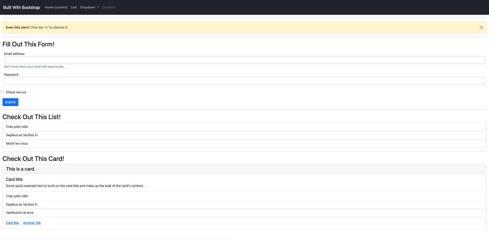

# 📖 Add Bootstrap Components to the Page

Work with a partner to implement the following user story:

* As a developer, I want to be able to quickly put together a webpage without having to write custom CSS.

## Acceptance Criteria

* It's done when the page has a styled navbar.

* It's done when the page has a styled and dismissible alert box.

* It's done when the page has a styled form.

* It's done when the page has a styled list with badges.

* It's done when the page has a styled card with a list, header, and footer.

## 📝 Notes

Refer to the following documentation:

[Bootstrap Documentation for Components](https://getbootstrap.com/docs/5.1/components/)

## Assets

The following image demonstrates the web application's appearance and functionality:

---

## 💡Hints

* When in doubt, use the Bootstrap documentation links in the comments and Chrome DevTools to break down the classes and styles used!

* Look down the left-hand side of the Bootstrap documentation to see the different types of components.

## 🏆 Bonus

If you have completed the activity and want to further your knowledge, work through the following challenge with your partner:

* How did Bootstrap come to be, and how are CSS frameworks like it useful for developers? Use [Google](https://www.google.com) or another search engine to research this question.

---
© 2024 edX Boot Camps LLC. Confidential and Proprietary. All Rights Reserved.
